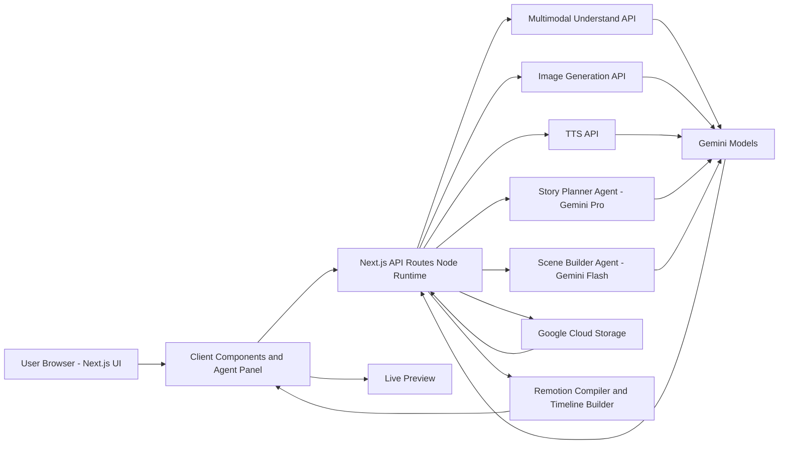

# Architecture Diagram

Interactive Mermaid link: [Mermaid diagram](https://mermaid.ai/d/23852a3d-1f82-4abb-a5ae-9994e40ba781)

## Diagram Notes

- The browser hosts the interactive editor and agent panel.
- Next.js API routes orchestrate the agent pipeline.
- Gemini-backed services cover planning, scene generation, multimodal understanding, image generation, and narration.
- Google Cloud Storage persists uploaded and generated media.
- Remotion compiles and previews the resulting timeline.
